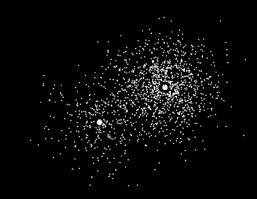

# :rocket: Progetto PCPC N-body
N-body è un problema di tipo fisico che consiste nella predizione dei movimenti di corpi celestiali in relazione all'influenza della gravità. Generalmente l'input del problema consiste nella posizione, velocità e tempo di ogni corpo celestiale, di cui si tenta di predire la posizione attraverso l'interazione con tutti gli altri corpi. Data la natura del problema è quindi possibile effettuarne una simulazione attraverso appositi algoritmi. Uno dei più famosi è quello di Barnes-Hut, con tempo di computazione pari a O(n logn), tuttavia, ai fini dell'esame si è scelto di utilizzare l'algoritmo con tempo quadratico rispetto all'input. Questo è stato opportunamente parallelizzato mediante la libreria MPI e testato su un cluster AWS di tipo t2.xlarge composto da 8 macchine, usando al più 2 vCPUs per ogni elaboratore.

<p align="center"></p>

# :high_brightness: Descrizione
Questo progetto è stato realizzato per l'esame "programmazione concorrente, parallela e su cloud" dell'Università degli Studi di Salerno. Per ulteriori informazioni è possibile consultare la documentazione disponibile [qui](./documentazione.pdf)

# :pushpin: Quick start
Per poter lanciare il programma sono necessari si seguenti comandi:
```bash
mpicc nbody.c -o nbody -lm
mpirun  -np {numero processi} nbody {numero bodies} {numero iterazioni} {dimensione minSize}
Esempio:
mpirun  -np 2 nbody 30000 10 1
```
